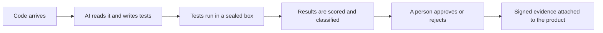

# Executive summary

**For:** executives, board members, managing directors, and anyone who needs the point in five minutes.

## The problem in one sentence

We test the code we write and trust the code we import, and most of what we ship is imported.

## What I am proposing

An **AI Test Harness**: a system that uses AI agents to write tests for every piece of code that enters
our products, runs those tests in a locked-down environment, proves whether they are any good, and hands
the results to a human for a decision. It covers our own code, the open source packages we choose to use,
and the packages those packages pull in, down to any depth.

## Why now

Three things changed at once.

1. **Supply chain attacks are the dominant risk.** The most damaging software incidents of the last
   several years came through dependencies, not through code our engineers wrote.
2. **Regulators and customers now ask for proof.** Frameworks such as SLSA and formats such as SBOM and
   VEX exist so that we can show, not just say, what we verified. Our build platform already produces
   most of that proof for the build step. It produces none of it for testing.
3. **AI can now write tests that are worth running.** Not perfect tests. Tests that, once we run them,
   score them, and let a human review them, are as good as the ones we write by hand and arrive in hours
   instead of quarters.

## What it does, in plain terms

- **Code arrives.** A pull request from our team, or a new version of a package we depend on.
- **AI writes tests.** Ordinary tests, tests that try to break the code, and tests aimed at known
  vulnerabilities.
- **Tests run in a sealed box.** No network, no secrets, thrown away afterward. Untrusted code cannot
  reach anything.
- **Results are scored.** We check that the tests would actually catch a bug, not just that they pass.
  We compare the new version against the old one to see what changed.
- **A person approves.** The harness never merges anything. It proposes. A reviewer decides.
- **Evidence is attached.** Every test carries a signed record of where it came from and who approved it.
  That record travels with the product and can be checked by anyone downstream.

It is used in two ways. A developer runs it while working, to get tests for the change in front of
them, and the tests go in with their pull request. The pipeline runs it on every change, unattended,
and proposes a test pull request for a person to read. Either way tests arrive through a pull
request, and the accepted ones run with the normal test suite from then on.

## What it is not

- It does not replace engineers or QE. It gives them evidence they do not have today.
- It does not merge code, publish security statements, or delete tests on its own. Every one of those is
  a human decision.
- It does not fix code. It may propose a fix, clearly labeled, through the normal review process.

## What it costs and what it returns

The cost is compute, a small team, and reviewer time. The return is fewer incidents from dependencies we
never looked at, faster and safer upgrades, and proof of testing that we can show a regulator or a
customer. The pilot is six weeks on two services and answers the question of whether the tests are good
enough before we spend more.

## The one number that matters

Regressions and vulnerabilities caught by harness-generated tests that nothing else would have caught,
reported quarterly. Every other metric is a means to that one.

## What I need

A decision to run the pilot, a named sponsor, a compute budget for six weeks, and two product teams
willing to review what the harness produces. Details are in [the case](01-the-case.md) and the
[roadmap](07-roadmap.md).
