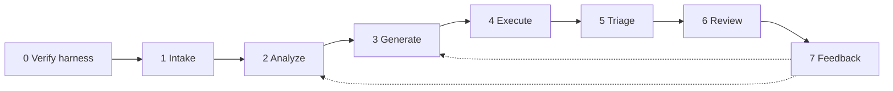
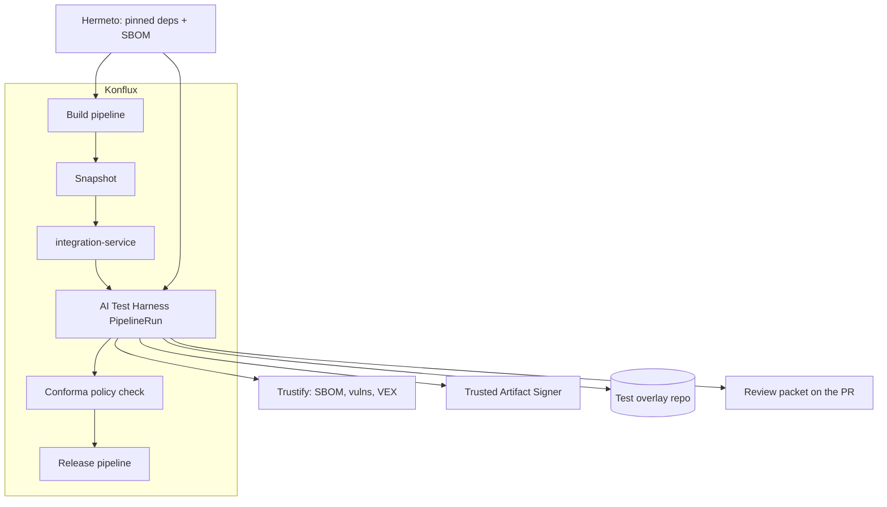
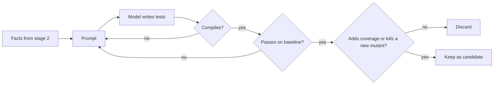
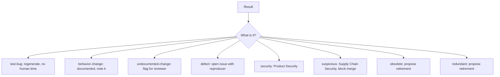
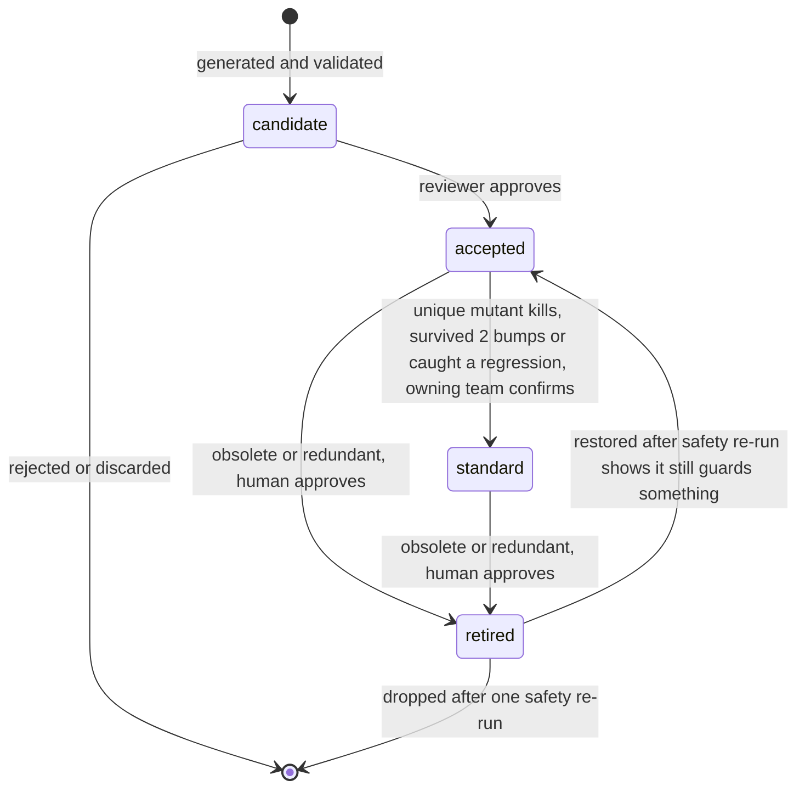
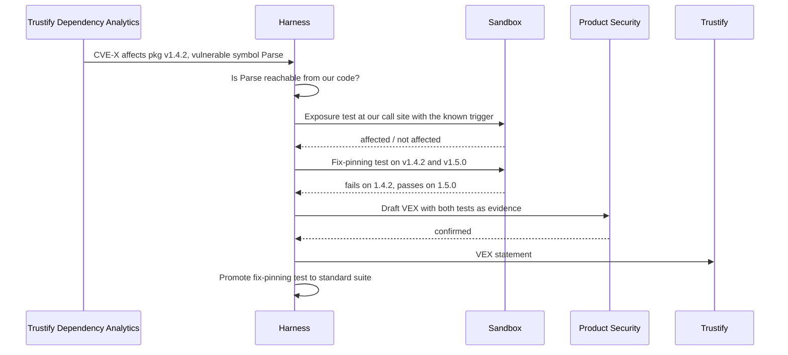

# How it works

**For:** engineers, architects, and technical leaders who want the mechanism before the detail. Thirty
minutes. The [blueprint](03-blueprint.md) has everything this leaves out.

## The shape of it

Every incoming change, regardless of where it came from, goes through the same seven stages.

I run the same pipeline on three kinds of input, and the only thing that varies is the budget:

| Input | Depth | Budget |
|---|---|---|
| Our own pull request | 0 | Full |
| A direct dependency changed version | 1 | Full, with functional tests aimed at our call sites |
| A transitive dependency changed version | 2 or deeper | Full if we can reach it or it scores high on risk, otherwise a cheap snapshot |
| Any package with a known vulnerability | Any | CVE-targeted tests always, regardless of depth |

## Where it runs

The harness is not a new pipeline. It is one more integration test in Konflux, Red Hat's open source
software factory, which already builds hermetically, produces SBOMs, signs provenance at SLSA Build
Level 3, and gates releases on policy.

## Stage by stage

### 0. Self-verification

Before anything else, the harness proves it is fit to run: every entry in its failure register has a
passing self-check, the sandbox's isolation claims hold, and the model endpoint honors the settings the
run will record. Any failure stops the run before intake. The [blueprint, section 17](03-blueprint.md#17-generation-failure-register-detect-correct-verify)
is the register: for every way the generator has failed, the issue, the reason, the cause, the automatic
correction, and the check that proves it on every run.

### 1. Intake

Hermeto has already resolved the complete dependency graph and produced the SBOM for the build. I diff
that SBOM against the last known-good one, run cheap pre-flight scans (GuardDog, the OpenSSF Malicious
Packages database, Capslock for Go), and produce a work list: one row per package that changed, with
its depth and whether our code can reach it.

### 2. Analysis

For each row, I gather facts with tools, not with the model. The public API surface from CodeLLM-Devkit
or the language's own tooling. The contract diff from japicmp, gorelease, cargo-semver-checks, griffe,
or API Extractor. The source diff. Our own call sites. Upstream's existing tests. Known vulnerabilities
with their affected symbols. Static analysis output. Release notes, treated as untrusted text. Then a
risk score decides how much generation budget this row gets.

### 3. Generation

The agent writes tests in the ecosystem's idiomatic framework, following the loop IBM Research
published as ASTER: facts in, tests out, compile, run, repair, fill coverage gaps, mock what is external.

Every test is written in the framework and layout the repository already uses and runs with the
command the team already runs. No harness-specific runner. That is what makes the tests usable in
existing CI/CD pipelines and standard operating procedures the day they are approved.

Six categories come out of this stage: unit tests, functional tests at our call sites, negative tests
with hostile input, CVE-targeted tests, fuzz targets, and the harness code that makes all of it run.

### 4. Execution and validation

Everything runs in a sealed sandbox: pinned base image, Hermeto's dependency set mounted, no network,
no secrets, kernel isolation for anything below depth 0, hard resource limits, destroyed afterward.

Then the gauntlet, in order: compile, run, re-run to catch flakes, measure coverage, mutate the code
and see which tests notice, and run the same tests against the previous version to see what changed.
Finally, the relevance check: which existing tests does this change make obsolete?

### 5. Triage

An agent classifies every failure and finding, with a confidence score and the evidence attached, in
the style of Red Hat's sast-ai-workflow.

Anything below the confidence threshold is escalated to a person instead of auto-routed.

### 6. Review

One packet per work item, posted where integration-service already reports: a one-page summary, the
tests as a patch against the overlay repository, coverage and mutation deltas, proposed promotions and
retirements, draft VEX statements, logs, the replay manifest, and a Conforma attestation. The reviewer
approves, edits, or rejects. Nothing merges without them.

### 7. Feedback

Reviewer edits and rejections become labeled examples for prompt evaluation. Tests that later catch a
real regression are tagged. That tag is the number I report.

## The test lifecycle

A generated test is not done when it passes. It has a life.

Every state change is recorded in the test's provenance record, which is signed and attached to the
build attestation. Retired tests keep their record. Nothing is deleted.

## Known vulnerabilities become evidence

For every CVE reported against a package version in the graph, the harness produces two tests and one
draft statement.

## Provenance and SLSA

Every input the harness reads is already attested by Konflux. Every output the harness produces is
attested by Konflux too, with an additional in-toto predicate carrying the test-evidence record. The
harness's own code, prompts, images, and models are built and attested the same way. Conforma verifies
the chain and emits a Verification Summary Attestation.

| Track | Target | When |
|---|---|---|
| Build L1 | Provenance exists, produced by the pipeline | Phase 0 |
| Build L2 | Signed by Trusted Artifact Signer, platform identified | Phase 1 |
| Build L3 | Unforgeable: secrets isolated, ephemeral runs | Phase 2 |
| Source L3 | Technical controls on overlay repo branches, attested | Phase 2 |
| Source L4 | Two humans approve every change to the standard suite | Phase 2 |

## What I build versus what I reuse

The [capability map](05-capability-map.md) has the full table. The short version: I reuse the build
platform, the SBOM tooling, the vulnerability store, the signing, the mutation engines, the reachability
analyzers, the API diff tools, the pre-flight scanners, and the fuzz harness generator. I build the
assembly, the generation and triage agents, cross-ecosystem differential testing, the relevance engine,
the overlay repository, and the CVE-to-VEX path.

## Creation and execution across languages and targets

Each language has an adapter that implements one interface, and each execution target has a
provisioner. The [language and target flows](09-language-and-target-flows.md) document has a diagram
for each. The rule is: the harness produces one artifact, an OCI image plus a tmt plan, and the target
only changes who provisions the machine that runs it.
