# Workflows, process maps, and RACI

**For:** everyone who will touch the harness. Each item below has a trigger, a process map, a RACI, its
inputs and outputs, and a service level. Diagrams are Mermaid and render on GitHub and in the slide deck.

## Roles

| Code | Role | Who |
|---|---|---|
| **HT** | Harness Team | Owns the pipeline, adapters, prompts, and the relevance engine |
| **PT** | Product Team | Owns the repository the change lands in; reviews packets for depth 0 and 1 |
| **PS** | Product Security | Reviews `security` findings, confirms VEX statements, owns embargo |
| **SCS** | Supply Chain Security | Reviews `suspicious` findings, owns the pre-flight gates and the merge block |
| **QE** | Quality Engineering | Co-reviews promotions to the standard suite, owns test conventions |
| **PLAT** | Platform | Konflux, OpenShift, Testing Farm, Trusted Artifact Signer, Trustify operators |
| **LEG** | Legal | License review for reused components and upstream contributions |
| **SPO** | Executive Sponsor | Funds phases, resolves cross-team disputes, receives the quarterly report |

RACI: **R** does the work. **A** owns the outcome, exactly one per row. **C** is consulted before.
**I** is informed after.

## Summary RACI across all workflows

| Workflow | HT | PT | PS | SCS | QE | PLAT | LEG | SPO |
|---|---|---|---|---|---|---|---|---|
| 0 Self-verification | R/A | | | I | | C | | |
| 1 Intake and inventory | R/A | I | I | C | | C | | |
| 2 Analysis and risk scoring | R/A | C | C | C | | | | |
| 3 Test generation | R/A | C | | | C | | | |
| 4 Execution and validation | R/A | I | | | | C | | |
| 5 Triage | R/A | I | C | C | | | | |
| 6 Review and merge | C | R/A | C | C | C | | | I |
| 7 Feedback and prompt evaluation | R/A | C | | | C | | | I |
| 8 Promotion to standard suite | R | A | | | C | | | |
| 9 Test retirement | R | A | | | C | | | |
| 10 CVE-targeted tests and VEX | R | I | A | C | | I | | |
| 11 Provenance and SLSA attestation | R | I | C | C | | A | | |
| 12 Prompt and model change | R/A | I | C | C | C | I | | I |
| 13 New ecosystem adapter | R/A | C | | | C | C | C | |
| 14 Reusing an open source component | R/A | | C | C | | C | C | |
| 15 Quarterly report | R | C | C | C | C | | | A |
| F1 Description fidelity (future) | R/A | C | C | C | | | | |
| F2 Malicious change detection (future) | R | C | A | C | | | | I |

---

## 0. Self-verification

**Trigger.** Every harness PipelineRun, before intake.

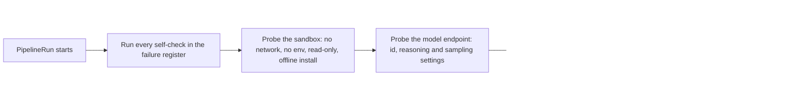

| Step | R | A | C | I |
|---|---|---|---|---|
| Maintain the register and its self-checks | HT | HT | QE | SCS |
| Run self-checks | HT (automated) | HT | | |
| Act on a failing check | HT on-call | HT | PLAT | SCS |
| Add an entry for a new failure mode | HT | HT | QE, PS, SCS | |

**Outputs.** `selfcheck.json`: every check, its register id, pass or fail. **Service level.** Under
two minutes. A failing check blocks the run; there is no override.

---

## 1. Intake and inventory

**Trigger.** Konflux snapshot ready; PR opened or updated; lockfile or SBOM diff; scheduled rescan.

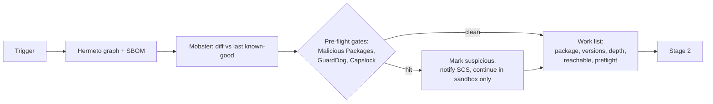

| Step | R | A | C | I |
|---|---|---|---|---|
| Configure triggers per repo | HT | HT | PT, PLAT | |
| Resolve graph and SBOM | HT (automated) | HT | PLAT | |
| Run pre-flight gates | HT (automated) | HT | SCS | |
| Handle a pre-flight hit | SCS | SCS | HT | PT, PS |

**Inputs.** Snapshot, previous SBOM, gate databases. **Outputs.** Work list, SBOM diff, pre-flight
findings. **Service level.** Work list within 10 minutes of trigger.

---

## 2. Analysis and risk scoring

**Trigger.** Work list row.

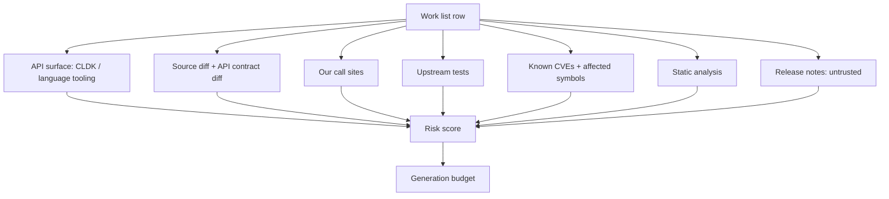

| Step | R | A | C | I |
|---|---|---|---|---|
| Extract facts with tools | HT (automated) | HT | | |
| Maintain risk score weights | HT | HT | PS, SCS, PT | |
| Override budget for a package | PT or PS | HT | | |

**Outputs.** Fact bundle per row, risk score, budget. **Service level.** 15 minutes per row at depth 0
and 1.

---

## 3. Test generation

**Trigger.** Fact bundle with a nonzero budget.

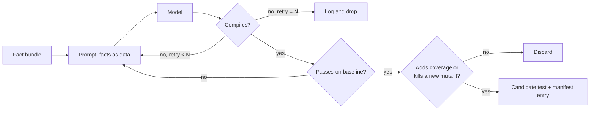

Runs once per category: unit, functional, negative, CVE-targeted, fuzz, harness code.

| Step | R | A | C | I |
|---|---|---|---|---|
| Own prompts and acceptance criteria | HT | HT | QE, PT | |
| Generate and self-repair | HT (automated) | HT | | |
| Decide the ecosystem's idiomatic framework | HT | HT | QE, PT | |
| Label proposed production fixes | HT (automated) | HT | PT | |

**Outputs.** Candidate tests, JSON manifest, proposed fixes as separate patches. **Service level.**
Within budget; never exceeds the per-item token and time caps.

---

## 4. Execution and validation

**Trigger.** Candidate tests exist.

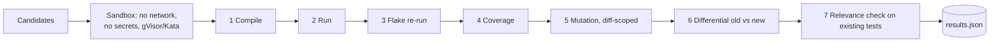

| Step | R | A | C | I |
|---|---|---|---|---|
| Sandbox image and runtime policy | PLAT | PLAT | HT, SCS | |
| Execute the gauntlet | HT (automated) | HT | | |
| Select execution target | HT (automated by rules) | HT | PLAT, PT | |
| Bare-metal reservation | PLAT | PLAT | HT | PT |

**Outputs.** results.json, coverage, mutation score, differential diff, relevance findings.
**Service level.** Depth 0 and 1 complete within 60 minutes; fuzzing time-boxed.

---

## 5. Triage

**Trigger.** results.json.

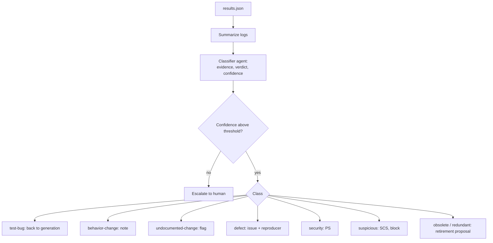

| Step | R | A | C | I |
|---|---|---|---|---|
| Classify with confidence | HT (automated) | HT | | |
| Set confidence thresholds | HT | HT | PS, SCS | PT |
| Handle escalations | HT on-call | HT | PT | |
| Handle `security` | PS | PS | HT | PT |
| Handle `suspicious` | SCS | SCS | HT, PS | PT, SPO if blocking a release |

**Outputs.** Classified findings, issues opened, merge block state. **Service level.** Classification
within 15 minutes; `suspicious` acknowledged by SCS within one business day.

---

## 6. Review and merge

**Trigger.** Review packet posted.

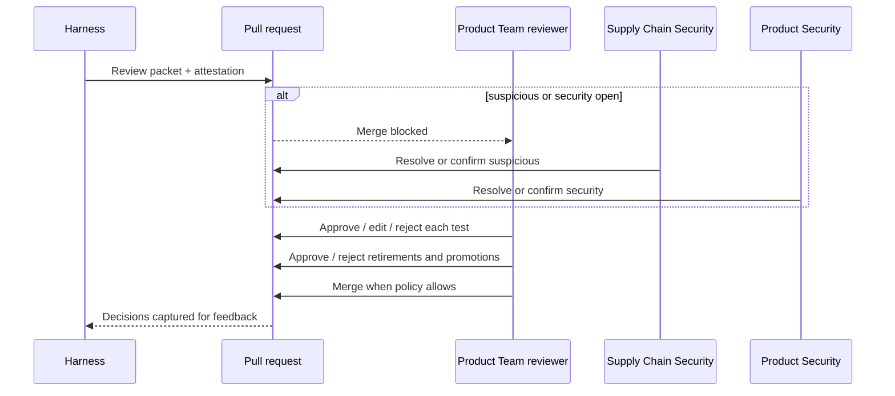

| Step | R | A | C | I |
|---|---|---|---|---|
| Post the packet | HT (automated) | HT | | PT |
| Review tests, retirements, promotions | PT | PT | QE, HT | |
| Clear a merge block | SCS or PS | SCS or PS | PT | SPO |
| Merge | PT | PT | | HT |
| Mark a packet "harness error" | PT | PT | | HT |

**Service level.** Packet within 2 hours of trigger for depth 0 and 1. Review turnaround is the
product team's normal PR SLA.

---

## 7. Feedback and prompt evaluation

**Trigger.** Reviewer decision recorded; regression caught by an overlay test.

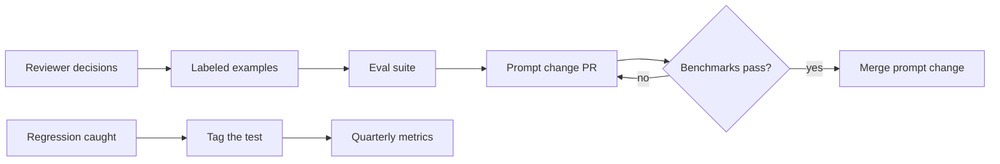

| Step | R | A | C | I |
|---|---|---|---|---|
| Curate labeled examples | HT | HT | QE | |
| Maintain benchmark suite (BUMP, TDD-Bench, Hamster, eval-dev-quality) | HT | HT | QE | |
| Approve prompt change | HT | HT | PT | SPO |

---

## 8. Promotion to the standard suite

**Trigger.** An `accepted` test meets the promotion criteria.

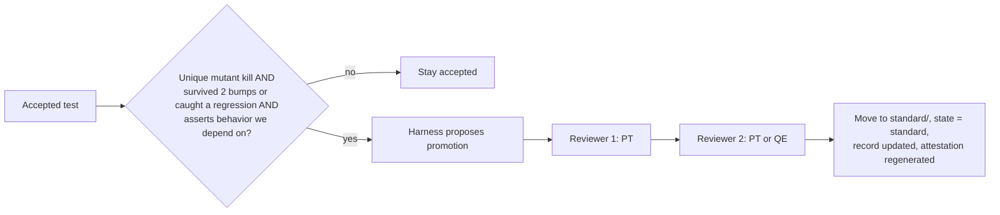

Two human approvals because the standard suite targets SLSA Source L4 and the harness is not a
trusted person.

| Step | R | A | C | I |
|---|---|---|---|---|
| Evaluate criteria and propose | HT (automated) | HT | | PT |
| First approval | PT | PT | | |
| Second approval | PT or QE | PT | HT | |
| Update record and attestation | HT (automated) | PLAT | | |

---

## 9. Test retirement

**Trigger.** Relevance check flags `obsolete` or `redundant`.

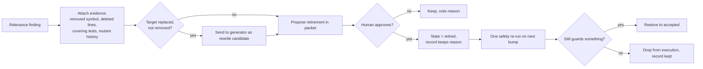

| Step | R | A | C | I |
|---|---|---|---|---|
| Detect and propose | HT (automated) | HT | | PT |
| Approve retirement of a generated test | PT | PT | QE | |
| Approve retirement of a human-written test | PT | PT | QE, original author if known | |
| Safety re-run and restore | HT (automated) | HT | | PT |

Retirement proposals never block a merge.

---

## 10. CVE-targeted tests and VEX

**Trigger.** Trustify Dependency Analytics, OSV, or govulncheck reports a vulnerability for a package
version in the graph.

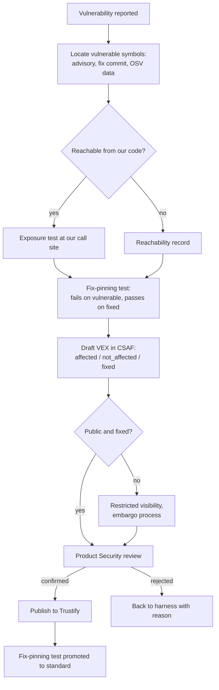

| Step | R | A | C | I |
|---|---|---|---|---|
| Generate exposure and fix-pinning tests | HT (automated) | HT | PS | |
| Draft VEX | HT (automated) | HT | | PS |
| Apply embargo and restricted visibility | PS | PS | HT | SCS |
| Confirm or reject VEX | PS | PS | HT, PT | SCS |
| Publish to Trustify | PS | PS | PLAT | PT |
| Promote fix-pinning test | HT | PT | PS | |

**Service level.** Draft VEX within 4 hours of the vulnerability appearing in the graph. Product
Security confirmation per its own SLA.

---

## 11. Provenance and SLSA attestation

**Trigger.** Every harness PipelineRun.

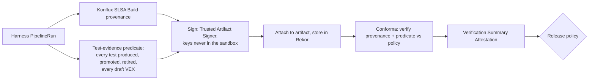

| Step | R | A | C | I |
|---|---|---|---|---|
| Define the test-evidence predicate schema | HT | HT | PS, SCS, PLAT | |
| Generate and sign attestations | HT (automated) | PLAT | | |
| Write Conforma policies | SCS | SCS | HT, PS, PT | |
| Verify and emit VSA | PLAT (automated) | PLAT | | PT |
| Measure and report SLSA level achieved | HT | PLAT | SCS | SPO |

---

## 12. Prompt and model change management

**Trigger.** A prompt file changes, or a model version is upgraded.

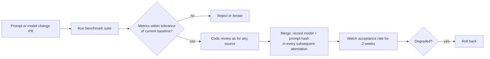

| Step | R | A | C | I |
|---|---|---|---|---|
| Propose change | HT | HT | | |
| Run benchmarks | HT (automated) | HT | QE | |
| Review | HT (second engineer) | HT | PS, SCS for triage prompts | PT |
| Roll back | HT | HT | | PT, SPO |

---

## 13. Adding an ecosystem adapter

**Trigger.** Roadmap phase or a product team request.

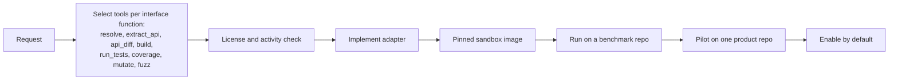

| Step | R | A | C | I |
|---|---|---|---|---|
| Tool selection | HT | HT | QE, PT | |
| License check | HT | HT | LEG | |
| Sandbox image | PLAT | PLAT | HT, SCS | |
| Pilot | HT | HT | PT | |

---

## 14. Reusing an open source component

**Trigger.** Any new dependency of the harness itself.

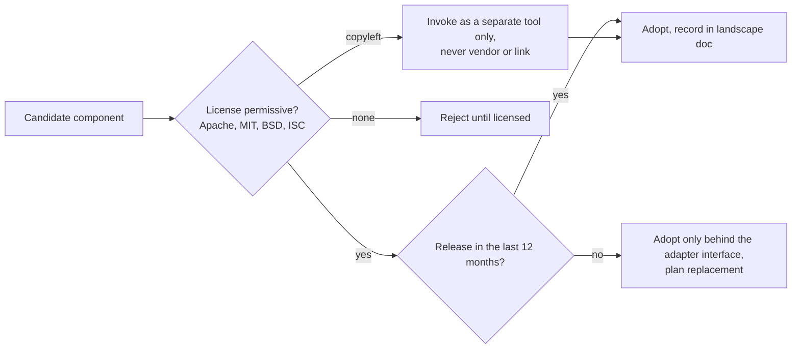

| Step | R | A | C | I |
|---|---|---|---|---|
| Evaluate | HT | HT | LEG, SCS | |
| Approve copyleft-as-tool pattern | LEG | HT | | |
| Update landscape document | HT | HT | | |

---

## 15. Quarterly report

**Trigger.** End of quarter.

Content: regressions and vulnerabilities caught by harness tests that nothing else caught; VEX
statements issued; standard suite growth; tests retired; cost per work item by ecosystem; SLSA level
achieved; reviewer acceptance rate; open risks.

| Step | R | A | C | I |
|---|---|---|---|---|
| Compile | HT | SPO | PT, PS, SCS, QE | All |
| Decide next phase funding | SPO | SPO | HT | All |

---

## F1. Description fidelity (future)

**Trigger.** Any change with a human-written description.

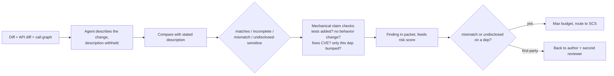

| Step | R | A | C | I |
|---|---|---|---|---|
| Build the check | HT | HT | PS, SCS | PT |
| Act on a mismatch on a dependency | SCS | SCS | HT | PT |
| Act on a mismatch on first-party code | PT | PT | | HT |

---

## F2. Malicious or vulnerable change detection (future)

**Trigger.** Any change, any party, any depth.

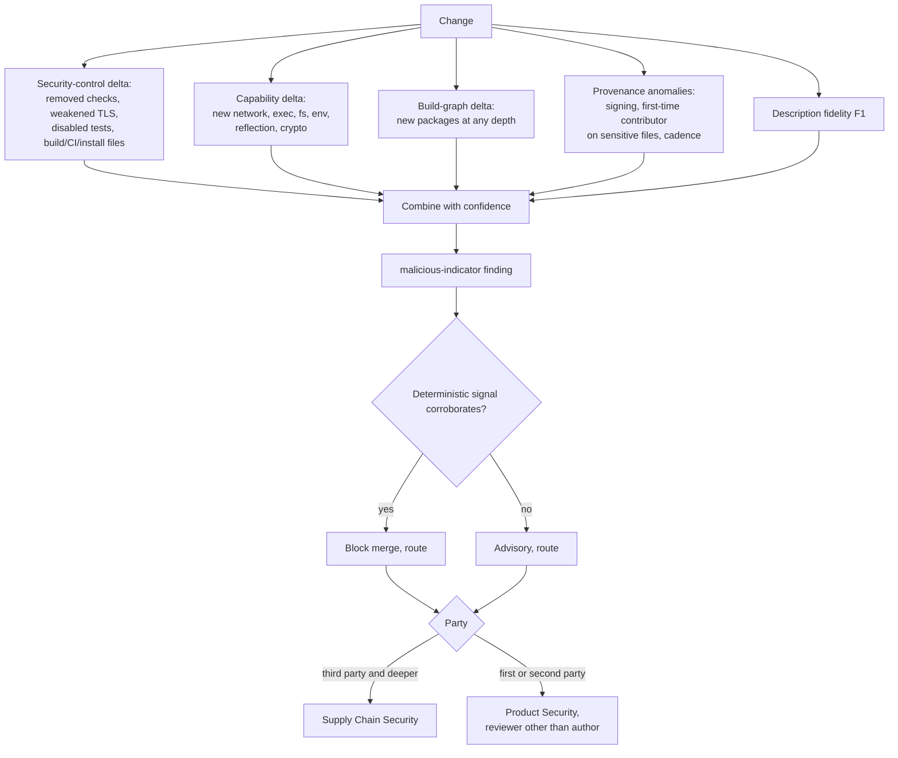

| Step | R | A | C | I |
|---|---|---|---|---|
| Build the deltas | HT | HT | PS, SCS | |
| Investigate third-party indicator | SCS | SCS | HT, PS | PT |
| Investigate first- or second-party indicator | PS | PS | HT, SCS, PT lead | SPO |
| Decide block policy | SCS and PS | PS | HT, PT | SPO |
