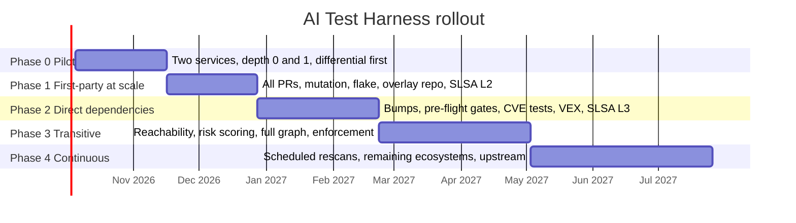

# Roadmap

**For:** leadership and the team. What happens when, and how we know each phase is done.

Dates are placeholders from a notional October 2026 start. Durations are estimates for a team of two to
four engineers and will be replaced by measured velocity after Phase 0.

## Phase 0: Pilot, weeks 1 to 6

**Goal.** Prove that generated tests are strong enough to be worth a reviewer's time, on real code.

- One Go service and one Python service, both already building on Konflux.
- Our own code (depth 0) and direct dependencies (depth 1) only.
- Build the differential step first and run it against BUMP, the public benchmark of about 570 real
  breaking Java dependency upgrades.
- Unit, functional, and negative tests. No fuzzing or mutation yet.
- Manual trigger. Review packets posted as PR comments.
- SLSA Build L1 and Source L1. The provenance manifest is produced by the pipeline, not by hand.

**Exit criteria.** Generated tests build more than 80 percent of the time after retries. At least one
real finding. Reviewer feedback collected from both teams. BUMP catch rate measured and reported.

## Phase 1: First-party at scale, weeks 7 to 12

**Goal.** Run on every PR in the pilot repositories without anyone pressing a button.

- Triggered by Konflux integration-service.
- Mutation testing and flake detection added. Weak and flaky tests never reach a reviewer.
- Test overlay repository, provenance manifest, and in-toto predicate established.
- First version of the relevance engine: tests whose target symbol or code path was removed are
  proposed for retirement.
- SLSA Build L2 (signed with Trusted Artifact Signer) and Source L2 for the overlay repository.

**Exit criteria.** All metrics within 20 percent of target. Every accepted test carries a signed record.

## Phase 2: Direct dependencies, weeks 13 to 20

**Goal.** Every dependency bump in the pilot repositories arrives with evidence.

- Differential testing and generation on every version change.
- Pre-flight gates (GuardDog, OpenSSF Malicious Packages, Capslock) and the suspicious-finding merge
  gate.
- CVE-targeted tests and draft VEX statements, every draft reviewed by Product Security.
- OSS-Fuzz-gen for packages flagged sensitive.
- Java and Rust adapters. CodeLLM-Devkit evaluated for Java reachability.
- Promotion to the standard suite goes live. Relevance engine adds behavior-change and redundancy
  detection.
- SLSA Build L3, Source L3 for overlays, Source L4 for the standard suite. Conforma emits Verification
  Summary Attestations. Policies advisory.

**Exit criteria.** Every direct dependency in a pilot release has at least one accepted test. Every
known vulnerability has a confirmed VEX statement. Product Security confirms more than 80 percent of
drafts without rework.

## Phase 3: Transitive dependencies, weeks 21 to 30

**Goal.** Cover the full graph at a cost we can sustain.

- Reachability analysis and risk scoring live, fed by Trustify Dependency Analytics.
- Characterization snapshots for every package in the graph.
- Risk-weighted generation for depth 2 and deeper. CVE-targeted tests at every depth.
- Cost controls and budget alerts per ecosystem.
- Conforma policies move from advisory to enforced.

**Exit criteria.** Full-graph run completes within budget on both pilot services. Cost per work item
reported. No release blocked by a false positive for four consecutive weeks.

## Phase 4: Continuous operation, week 31 onward

- Scheduled full-graph rescans independent of PR activity.
- Remaining ecosystem adapters: JavaScript and TypeScript, C and C++. tmt plans for OS-level functional
  tests on Testing Farm.
- Upstream contribution workflow for high-value overlay tests.
- Quarterly report: regressions caught, VEX statements issued, cost, standard suite growth.

## Documented for later, not scheduled

Two capabilities are designed into the architecture but not on this timeline. They share the harness's
intake, sandbox, and provenance, and they are better built once the harness's own chain of trust is
established.

- **Description fidelity.** Checking that a pull request or release note describes what the change
  actually does, with the description withheld from the AI until it has described the diff itself.
- **Malicious or vulnerable change detection** across first-party, second-party, third-party, and
  transitive code, including indirect changes to build scripts, CI configuration, tests, and lockfiles.

Both are specified in [the blueprint, section 16](03-blueprint.md#16-future-enhancements-documented-now-not-scheduled).

## What "done" means

The harness is done when a dependency bump at any depth, in any supported ecosystem, produces within two
hours a signed, human-reviewed packet that says what changed, whether we are exposed to anything known,
and which tests now guard it, and when a quarterly report can show what that evidence caught.
