# Harness creation and execution flows by language and target

**For:** engineers building or operating adapters. This is the document that says exactly what happens
for Go versus Rust, and on a Kubernetes pod versus a bare-metal machine.

## The contract that makes this manageable

Every language adapter produces the same artifact, and every execution target consumes it. That is the
whole trick. The adapter knows the language. The provisioner knows the machine. Neither knows the other.

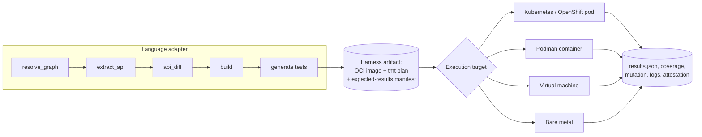

The harness artifact is:

| Part | Content |
|---|---|
| OCI image | Pinned base for the ecosystem, Hermeto-prefetched dependencies, the package under test at old and new versions, the generated tests, the overlay and standard tests, the runner script |
| tmt plan | Declares how to execute, what to collect, resource limits, and which target classes are acceptable. Runs unchanged on every target because tmt is the engine behind Testing Farm |
| Expected-results manifest | What each test asserts, which are differential, which are CVE-targeted, so the collector can classify without re-reading source |

Results come back in one schema regardless of target, and the attestation names the target class and
the provisioner so that provenance is complete.

## Choosing a target

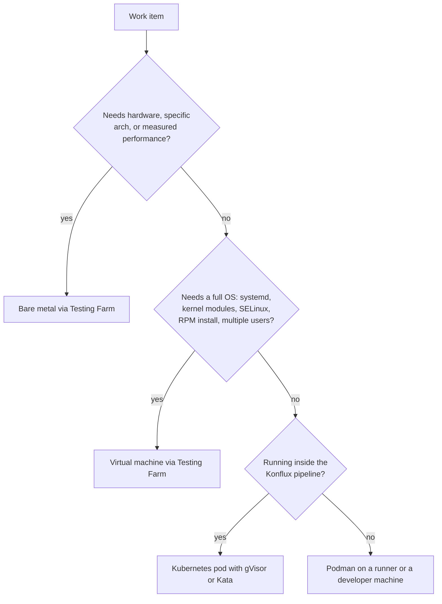

| Target | When | Isolation | Provisioner | Cost |
|---|---|---|---|---|
| Kubernetes / OpenShift | Default for every Konflux run | RuntimeClass gVisor or Kata (OpenShift sandboxed containers), deny-all NetworkPolicy, no service account token, resource limits, pod deleted after run | Tekton TaskRun inside the harness PipelineRun | Lowest |
| Podman | Developer reproducing a review packet locally; CI runners outside Konflux; air-gapped environments | Rootless, `--network=none`, read-only rootfs, dropped capabilities, gVisor or crun-krun runtime for depth 1 and deeper | The runner script, same image | Low |
| Virtual machine | Package is RPM-delivered, needs OS services, SELinux policy, kernel interfaces, or multi-user behavior | Fresh VM from a golden image, no outbound network after the image is pulled, snapshot discarded after run | tmt provision through Testing Farm (Artemis) | Medium |
| Bare metal | Drivers, firmware interfaces, accelerator libraries, architecture-specific code (aarch64, ppc64le, s390x), performance-sensitive packages where virtualization skews results | Machine reprovisioned and wiped after every run; network isolated at the switch or by Testing Farm policy | tmt provision through Testing Farm (Beaker pool) | Highest, so risk score must justify it |

## Creation flows by language

Each flow below is the adapter's implementation of the interface in
[blueprint/adapter-interface.md](../blueprint/adapter-interface.md). Tools marked "verify" were not in
the landscape research and need confirmation before adoption.

### Go

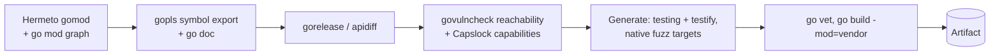

| Step | Tool |
|---|---|
| Resolve | Hermeto `gomod`, `go mod graph` for depth |
| API surface | `go doc -all`, gopls |
| API diff | gorelease, apidiff |
| Reachability and capabilities | govulncheck, Capslock |
| Test framework | `testing`, testify |
| Coverage | `go test -cover -coverprofile` |
| Mutation | gremlins `--only-diff` |
| Fuzz | `go test -fuzz` native targets |
| Build | `go build`, `go vet`, offline with vendored or module cache from Hermeto |

### Python

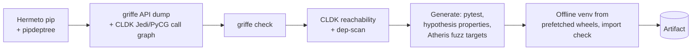

| Step | Tool |
|---|---|
| Resolve | Hermeto `pip`, pipdeptree |
| API surface and call graph | griffe, CodeLLM-Devkit (Jedi, PyCG) |
| API diff | `griffe check` |
| Reachability | CodeLLM-Devkit, dep-scan |
| Test framework | pytest, hypothesis for properties |
| Coverage | coverage.py |
| Mutation | mutmut, or cosmic-ray for distributed runs |
| Fuzz | Atheris via OSS-Fuzz-gen |
| Build | Offline virtualenv from Hermeto-prefetched wheels and sdists |

### Java and Kotlin

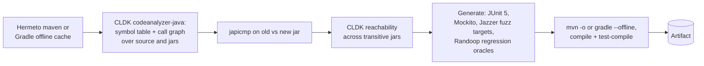

| Step | Tool |
|---|---|
| Resolve | Hermeto `maven` (experimental), Gradle dependency cache |
| API surface and call graph | CodeLLM-Devkit codeanalyzer-java, which walks JAR, EAR, WAR and their dependencies |
| API diff | japicmp, Revapi as alternative |
| Reachability | CodeLLM-Devkit |
| Test framework | JUnit 5, Mockito; Kotlin via kotlin-test on JUnit 5 |
| Coverage | JaCoCo |
| Mutation | PIT |
| Fuzz | Jazzer via OSS-Fuzz-gen |
| Random oracles | Randoop, cheap regression tests for dependencies |
| Build | Maven or Gradle offline |

### Rust

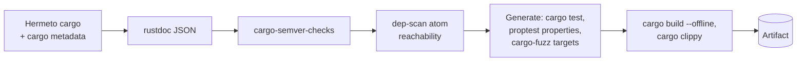

| Step | Tool |
|---|---|
| Resolve | Hermeto `cargo`, `cargo metadata` |
| API surface | rustdoc JSON output |
| API diff | cargo-semver-checks |
| Reachability | dep-scan with atom (Rust support added 2026) |
| Test framework | built-in `cargo test`, proptest |
| Coverage | cargo-llvm-cov |
| Mutation | cargo-mutants `--in-diff` |
| Fuzz | cargo-fuzz; harness generation is ours, OSS-Fuzz-gen does not cover Rust |
| Build | `cargo build --offline` from the Hermeto vendor directory |

### JavaScript and TypeScript

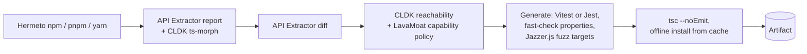

| Step | Tool |
|---|---|
| Resolve | Hermeto `npm`, `pnpm`, `yarn` |
| API surface | API Extractor, CodeLLM-Devkit ts-morph |
| API diff | API Extractor report diff |
| Reachability and capabilities | CodeLLM-Devkit, LavaMoat per-package capability policy |
| Test framework | Vitest or Jest, fast-check for properties |
| Coverage | c8 or istanbul |
| Mutation | StrykerJS |
| Fuzz | Jazzer.js (verify current maintenance) |
| Build | `tsc --noEmit`, offline install from the prefetched cache |

### C and C++

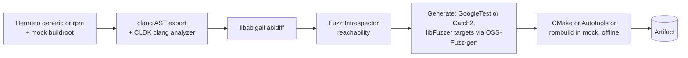

| Step | Tool |
|---|---|
| Resolve | Hermeto `generic` and `rpm`, mock buildroot for RPM-delivered code |
| API surface | clang AST dump, CodeLLM-Devkit clang analyzer |
| ABI and API diff | libabigail abidiff (Red Hat maintained) |
| Reachability | Fuzz Introspector |
| Test framework | GoogleTest or Catch2 |
| Coverage | gcov, llvm-cov |
| Mutation | mull (LLVM-based, verify license and activity) |
| Fuzz | libFuzzer and AFL++ targets via OSS-Fuzz-gen |
| Build | CMake, Autotools, or `rpmbuild` inside mock, all offline |

C and C++ is the ecosystem most likely to need the VM and bare-metal targets, because so much of it is
RPM-delivered and kernel-adjacent.

## Execution flows by target

### Kubernetes and OpenShift (default)

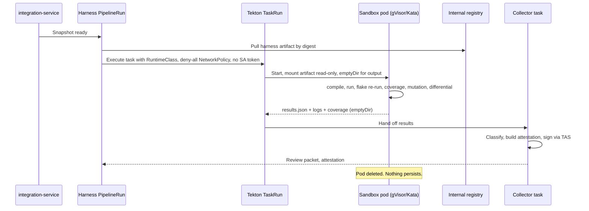

Controls: RuntimeClass `gvisor` or `kata` required for depth 1 and deeper by admission policy;
NetworkPolicy deny-all on the namespace; `automountServiceAccountToken: false`; read-only root
filesystem; CPU, memory, and `activeDeadlineSeconds` limits; the signing step runs in a separate task
that never shares a pod with test execution, which is what SLSA Build L3 requires.

### Podman

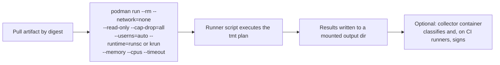

Podman is the developer's reproduction path. A review packet includes the exact `podman run` line and
the artifact digest, so any engineer can replay the run on a laptop and get the same results.json. On CI
runners outside Konflux the same image runs with the same flags and the collector signs; on a laptop
there is no signing and the attestation is marked `replay, unsigned`.

### Virtual machine (Testing Farm)

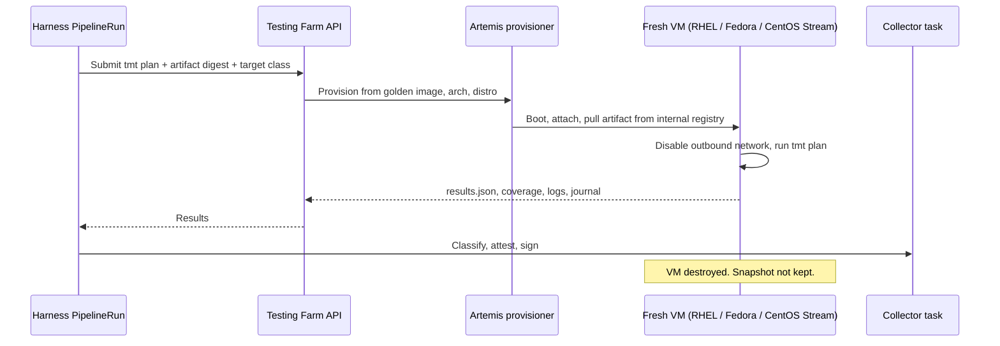

Use for RPM-delivered packages, anything that touches systemd, SELinux, kernel interfaces, or multiple
users, and for distro matrix runs (RHEL 9, RHEL 10, Fedora, CentOS Stream). tmt's provision step selects
the image; the plan is the same one that ran on Kubernetes.

### Bare metal (Testing Farm, Beaker pool)

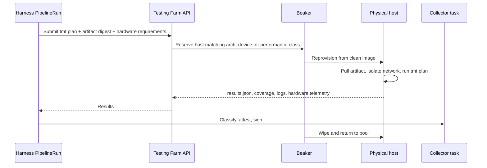

Use only when the risk score or the package class demands it: drivers, firmware interfaces, accelerator
and GPU libraries, architecture-specific code, and packages whose failure mode is performance. Every
bare-metal run is logged with its hardware identity in the attestation, and the wipe is verified before
the host returns to the pool.

## Language and target matrix

| | Kubernetes | Podman | VM | Bare metal |
|---|---|---|---|---|
| Go | Default | Replay | Rarely: cgo with system libs | Arch-specific builds |
| Python | Default | Replay | C extensions against system libs; RPM-packaged Python | Rarely |
| Java, Kotlin | Default | Replay | Rarely | Rarely |
| Rust | Default | Replay | Rarely: system FFI | Arch-specific, embedded targets |
| JavaScript, TypeScript | Default | Replay | Rarely: native addons | Rarely |
| C, C++ | Default for pure libraries | Replay | RPM-delivered, systemd, SELinux, kernel-adjacent | Drivers, firmware, accelerators, performance |

## What the adapter interface guarantees

Adding a language means implementing eight functions: `resolve_graph`, `extract_api`, `api_diff`,
`build`, `run_tests`, `coverage`, `mutate`, `fuzz`. Adding a target means implementing one provisioner
that accepts a tmt plan and an artifact digest and returns results in the common schema. The pipeline,
the agents, the triage, the provenance, and the review packet do not change for either.
