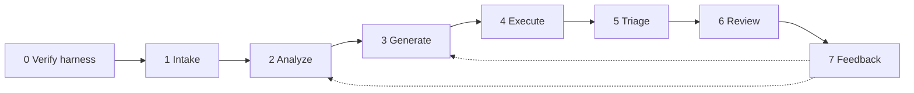

<!-- _class: lead -->

# Blueprint, implementation, evidence

## How the harness works, what it is built from, and what it has proven. For engineers, architects, and security analysts.

Chris Roadfeldt. Thirty minutes.

---

# Three layers, one repository

| Layer | Where | What it is |
|---|---|---|
| Blueprint | `docs/`, `blueprint/` | What the harness must do and why; the failure register; the schemas |
| Opinionated implementation | `harness/` | One way of doing it, for Python packages, with the capability map's choices fixed |
| Evidence | `examples/` | What the implementation produced on real code, kept exactly as produced |

Two rules in order: the quality of a result comes first; then it is written so a person can read it.

---

# The pipeline



Stage 0 runs the failure-register checks, probes the sandbox, and probes the model. Any failure stops the run. No override.

---

# One core, two lifecycles

| | Developer's inner loop | Pipeline's outer loop |
|---|---|---|
| Starts | on the developer's branch, while working | on every pull request or merge, unattended |
| Runs | locally or ephemeral, same sealed sandbox | in the pipeline's sandbox |
| Produces | candidates and verdicts to iterate on | a packet and a test pull request |
| Gate | the code review | the test pull request |
| Afterwards | the suite runs the accepted tests | the suite runs the accepted tests |

Stage 4 is validation: both versions, sealed, once. Regression is the suite's job, every change, and not a harness stage. Generated tests are untrusted until read, so the developer's loop uses the same sandbox, never a plain test runner. The CLI is the core as lifecycle A runs it; the step that opens the test pull request is what lifecycle B still needs.

---

# Stage 1, intake: facts before anything runs

- Resolve the full dependency graph for the project's own interpreter, inside its container image. pip on a different interpreter silently drops marker-gated packages; that was found the hard way.
- Diff base against head; emit a CycloneDX SBOM.
- One batch query to OSV for every package version, which doubles as the malicious-package gate.
- Work list: one row per package with change, depth, reachability, and pre-flight state.

On the example PR this is where pip's silent downgrade of pyasn1 first appeared.

---

# Stage 2, analyze: tools, not guesses

Per changed or vulnerable package: the public API surface from the AST, the contract diff with breaking flags, every first-party call site, advisories with fixed versions, the unified diff between versions as the "fix diff", and a risk score whose every contribution is written down.

| Input | Weight |
|---|---|
| Reachable from first-party code | +35 |
| Known vulnerabilities on this version | +25, +10 if rated |
| Breaking API changes | +15 |
| Sensitive domain (auth, crypto, parsing) | +10 |

The score sets the generation budget. Stages 0 to 2 never call a model.

---

# The sandbox, and how it is proven

Podman: no network, all capabilities dropped, no new privileges, read-only root, tmpfs work directory, memory, pid, cpu and time limits, environment cleared, packages installed offline from a prefetched wheelhouse, container removed afterwards.

A probe file runs inside the real sandbox at stage 0 and asserts each claim. It found the base image exporting a credential-shaped variable on the first run; the environment is cleared because of it.

---

# Stage 3, generate: two variants, one set of gates

**Fixed script:** facts in as delimited data, one file out, compile, baseline run, repair with the error, cut failing tests, coverage gate.

**Tool-using:** the model gets search, read, list-API, and run-tests-on-both-versions, plus submit, under a budget. Reads are capped until a test has run; calls are reserved for a run and a submit; an identical result twice is reported as a blocked path; a failure carrying text the fix diff added is reported as "you reached the fix".

Every prompt, response, tool call, and result digest is written to disk. Tool results are data, never instructions.

---

# Stage 4, execute: the gauntlet

1. Run on head. 2. Run again for flakes. 3. Coverage of the package. 4. Differential: run on the base commit's own graph, or on a resolved fixed candidate when the package did not change. 5. Mutation: a seeded, coverage-scoped sample of mutants overlaid into the sandbox; the passing tests run against each.

The verdict per test follows roles, not commit order: on a downgrade the new version is the vulnerable one. A CVE test counts only when it fails on the vulnerable version and passes on the fixed one.

---

# Fixed candidates: when the change did not move the package

starlette was vulnerable at head and untouched by the PR. Pinning it to the fixed 1.3.1 does not resolve, because fastapi pins it. The harness relaxed fastapi's pin, resolved fastapi 0.141.1 with starlette 1.3.1, ran the tests against that, and wrote the upgrade path into the packet.

That is a finding a reviewer needs and a diff never shows.

---

# Stages 5 and 6: triage and the packet

Triage is deterministic: the blueprint's classes with a confidence and a route; below 0.7 escalates to a person. An agent's claim of a defect counts only if stage 4 corroborates it.

The packet opens in plain terms: what the change did to the package, how many vulnerabilities were proven, how many remain unproven, what to do. Then the accepted tests as a patch in the overlay layout, findings with routes, a draft OpenVEX statement per vulnerability, and the artifact paths. Beside it, `pull-request.md` is what the test pull request carries, and the run's own `README.md` tells the whole story for a general reader: who, what, why, where, when, the decisions, the actions, and every file by the reader it is for.

---

# Attestation, and the records behind it

- A provenance record per accepted test, in the blueprint's schema.
- The same facts as UDLM records: vulnerability, package, run, test evidence at the harness's provider class, draft VEX statement. Sealed with UDLM's own chain code.
- An in-toto statement with the vetted test-result predicate whose subjects are the patch, the record file, and each evidence record's head. Signed as a DSSE envelope, verified.
- An "unverified" list on every statement naming what the run could not back: development signing key, no mutation baseline, and so on.

---

# The failure register: the harness tests itself first

Twenty-two entries, each with the issue, why it matters, the cause, the detector, the automatic correction, and a self-check that runs at stage 0. Written check-first: the check fails on the old code and passes after the fix.

| Id | In one line |
|---|---|
| GF-003 | catch-all assertions cannot fail; rejected |
| GF-006 | tests imported names only the fixed version has; must collect on both |
| GF-013 | the agent read source until its budget ran out; reads capped |
| GF-015 | eleven identical failures in a row; reported as a blocked path |
| GF-016 | on a downgrade the new version is the vulnerable one; roles from advisories |
| GF-019 | reasoning streamed as content and looped; detected, thinking off |
| GF-020 | a file that never collected on the baseline shipped as kept; now discarded |
| GF-021 | a tool call cut off at the output limit poisoned the history; neutralised and reported |
| GF-022 | one Go file that did not compile silenced the package; the rest run, its tests read as compile errors |

---

# The evidence, one pull request

| Package | Change | Proven | Unproven | VEX draft |
|---|---|---|---|---|
| python-jose | 3.3.0 to 3.4.0 | 1 closed | 2 | 1 fixed, 2 under investigation |
| pyasn1 | 0.6.4 down to 0.4.8 | 1 introduced | 3 | 1 affected with evidence |
| starlette | unchanged 0.41.3 | 1 live | 6 | 7 affected, upgrade path |

Mutation scores 0.42, 0.42, 0.0 against a 0.6 target: stated as not met. 76 UDLM records, all sealed, zero schema problems. Nine of eleven goals met.

---

# The ladder: one variable per run

| Run | Change | Proven | Time |
|---|---|---|---|
| 1 | baseline | 0 of 3 | 22 min |
| 2 | weak-assertion gate, dependency imports, loop abort | 0 of 3 | 15 min |
| 3 | fix diff and version-only symbols in the prompt | 0 of 3 | 20 min |
| 4 | tool-using generation | 0 of 3 | 60 min |
| 5 | read cap, fix-reached hint, blocked-path detection | 1 of 3 | 55 min |
| 6 | same model on a two-GPU server | 2 of 3 | 22 min |

Every run is kept as produced. The register grew from each one.

---

# Run it

```
cp harness/harness.example.toml harness/harness.local.toml   # endpoint, repo, interpreter, UDLM checkout
cd harness && python3 -m venv .venv && .venv/bin/pip install -e ".[dev]"
.venv/bin/harness selfcheck --workdir out/run1                # stage 0
.venv/bin/harness intake   --base main --head HEAD --workdir out/run1
.venv/bin/harness analyze  --workdir out/run1
.venv/bin/harness generate --workdir out/run1 --select <pkg> --categories cve unit --mode agent
.venv/bin/harness execute  --workdir out/run1 --select <pkg>
.venv/bin/harness mutate   --workdir out/run1 --select <pkg>
.venv/bin/harness triage --workdir out/run1; harness packet --workdir out/run1; harness attest --workdir out/run1
.venv/bin/harness assess   --workdir out/run1
```

Nothing about a machine, endpoint, or path is in the repository. Records carry labels and digests.

---

# What is fixed, and what is a variable

**Fixed:** Tekton on Konflux as the pipeline; Podman today and a Kata pod on the cluster; OSV; pip's resolver in the target image; the standard library AST; the harness's own mutator until a mutmut integration for installed packages exists; in-toto test-result; OpenVEX; UDLM records.

**Variables, one at a time:** the model and its serving; the generation variant; the budgets. The ladder is how a variable earns its place.

---

# Known limits, stated

- Most vulnerabilities tried remain unproven at this model size; a stronger model is the next variable, and Go is where it shows first: the 27B rarely writes Go that compiles.
- Mutation scores are below target on every package; the packets say so.
- Signing uses a development key; Trusted Artifact Signer replaces it in Konflux. The harness's pull requests carry a placeholder identity until a bot account exists.
- Go first-party targets, and propose and feedback inside the Tekton pipeline, are not wired yet.

---

# What is next

1. A stronger model as the next ladder rung, on Go first.
2. Go first-party targets: tests placed inside the module.
3. Propose and feedback inside the Tekton pipeline, once the bot identity has credentials and a signing key.
4. Reviewer decisions feeding prompt evaluation, now that they are captured.

The blueprint, the code, and every run are at the project site and repository.
