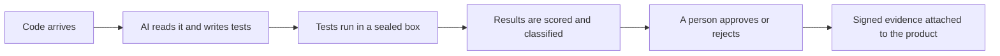
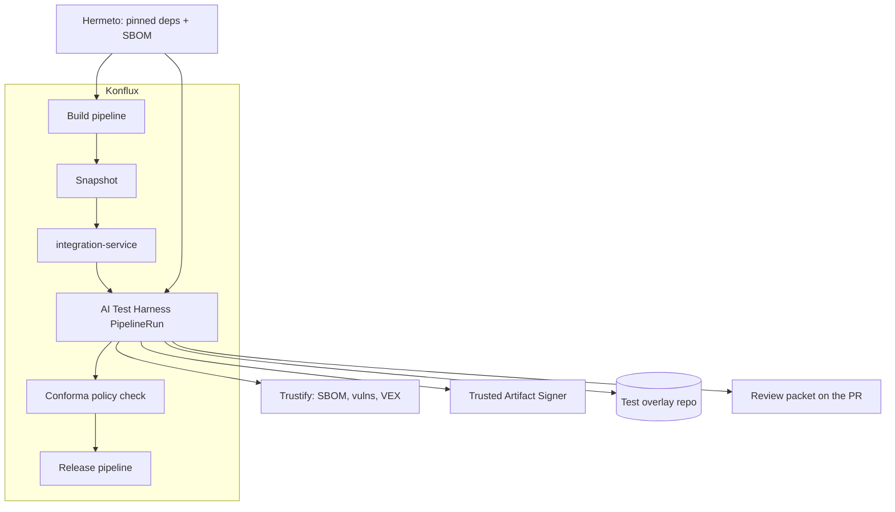
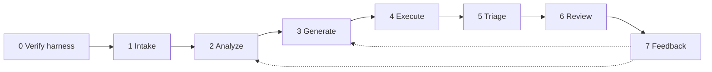
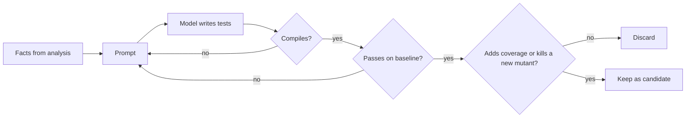
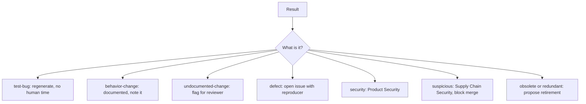
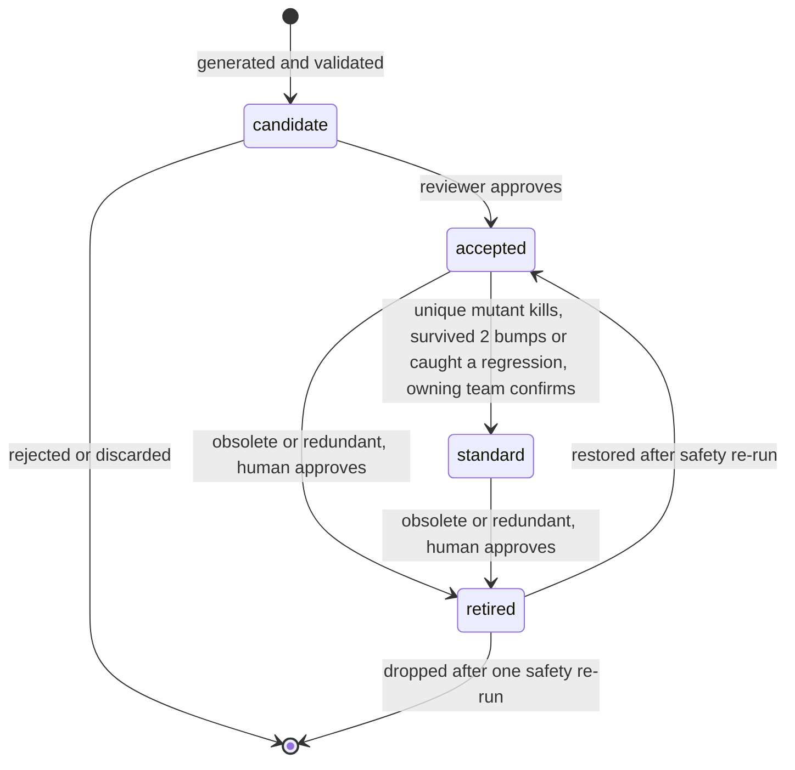
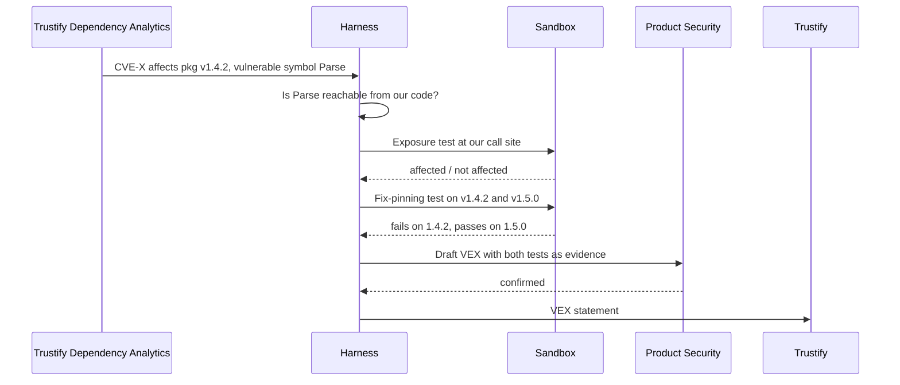
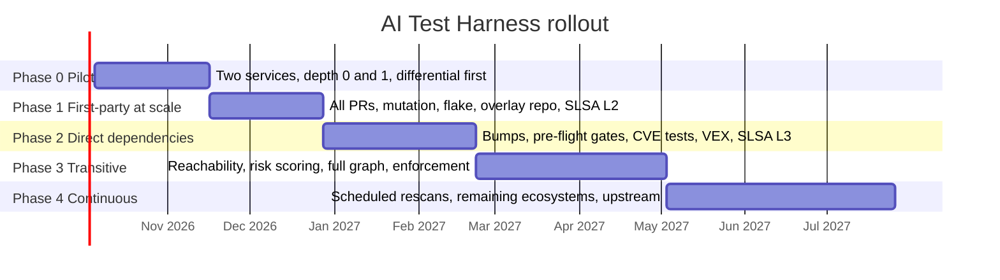

<!-- _class: lead -->

# AI Test Harness

## Tests for every piece of code we ship, including the code we did not write

Chris Roadfeldt, September 2026. Working draft.

Rendered with Slidev (Mermaid built in) or Marp with its Mermaid plugin. Sources in `../diagrams/`.

---

# The problem in one sentence

**We test the code we write and trust the code we import, and most of what we ship is imported.**

- A mid-sized Go or Java service resolves hundreds to a few thousand packages.
- Our engineers chose perhaps fifty of them. The rest arrived as dependencies of dependencies.
- Nobody on our side has read them. Nobody on our side has tested them.
- When one of them changes behavior in a minor version, we find out in production.

<!-- Speaker: XZ Utils, 2024. A trusted package, a routine update, a description with no relation to the effect. -->

---

# Why now

1. **Supply chain attacks are the dominant risk.** The most damaging incidents of the last several years came through dependencies, not through code our engineers wrote.
2. **Regulators and customers ask for proof.** SLSA, SBOM, and VEX exist so we can show what we verified. Konflux produces that proof for the build step. It produces none of it for testing.
3. **AI can now write tests worth running.** Not perfect tests. Tests that, once run, scored, and reviewed, match hand-written quality and arrive in hours instead of quarters.

---

# What I am proposing

- Covers our own code, the packages we choose, and the packages those pull in, to any depth.
- The harness never merges. It proposes. A reviewer decides.
- Every test carries a signed record of where it came from and who approved it.

---

# What it is not

- It does not replace engineers or QE. It gives them evidence they do not have today.
- It does not merge code, publish security statements, or delete tests on its own. Each of those is a human decision.
- It does not fix code. A separate fix pipeline does; this one hands it the failing test and tests what comes back.
- It is not a new pipeline. It is one more integration test in Konflux.

---

# Where it runs

Konflux already builds hermetically, produces SBOMs, signs provenance at SLSA Build L3, and gates on policy. The harness fills the testing half.

---

# Seven stages, every change

| Stage | What happens |
|---|---|
| Verify | The harness proves its own gates, sandbox, and model settings first. Fails closed. |
| Intake | SBOM diff against last known-good, pre-flight scans, work list |
| Analyze | Facts from tools, not the model: API surface, contract diff, call sites, CVEs |
| Generate | Tests in the ecosystem's own framework: unit, functional, negative, CVE, fuzz |
| Execute | Sealed sandbox: compile, run, flake re-run, coverage, mutation, differential |
| Triage | Classify every finding with confidence and evidence |
| Review | One packet per work item on the PR. A human decides. |
| Feedback | Reviewer decisions become labeled examples. Regressions caught are tagged. |

---

# Same pipeline, three kinds of input

Only the budget varies.

| Input | Depth | Budget |
|---|---|---|
| Our own pull request | 0 | Full |
| A direct dependency changed version | 1 | Full, with functional tests at our call sites |
| A transitive dependency changed version | 2 or deeper | Full if reachable or high risk, otherwise a cheap snapshot |
| Any package with a known vulnerability | Any | CVE-targeted tests, always |

---

# Generation: the loop that filters before a human looks

**Native first.** `go test`, `pytest`, `mvn test`, `cargo test`, `npm test`, `ctest` run these tests with no harness present. A test that needs a special runner has failed.

---

# Execution: the gauntlet

Everything runs in a sealed sandbox: pinned image, Hermeto's dependency set, no network, no secrets, kernel isolation below depth 0, hard limits, destroyed afterward.

1. Compile
2. Run
3. Re-run to catch flakes
4. Measure coverage
5. Mutate the code and see which tests notice
6. Run the same tests against the previous version and diff the results
7. Relevance check: which existing tests did this change make obsolete?

A test that survives this is worth a reviewer's minute. One that does not is never seen.

---

# Triage: every finding gets a class, a confidence, and evidence

Below the confidence threshold, a person gets it instead of a router. Only `security` and `suspicious` block anything.

---

# Review: humans own the merge

One packet per work item, posted where integration-service already reports:

- A one-page summary
- The tests as a patch against the overlay repository
- Coverage and mutation deltas
- Proposed promotions and retirements
- Draft VEX statements
- Logs, the replay manifest, and a Conforma attestation

The reviewer approves, edits, or rejects each test. Nothing merges without them. Packet within two hours of trigger at depth 0 and 1.

---

# A generated test has a life

Promotion to the standard suite takes two human approvals. Retirement is proposed with evidence, never done alone. Retired tests keep their record. Nothing is deleted.

---

# Known vulnerabilities become evidence

Draft VEX within four hours of the CVE appearing in the graph. Product Security confirms every one.

---

# Provenance: the harness extends the chain of trust

Every input is attested by Konflux. Every output is attested with the vetted in-toto `test-result/v0.1` predicate, signed by Trusted Artifact Signer, verified by Conforma. The harness's own code, prompts, images, and models are attested the same way.

| Track | Target | When |
|---|---|---|
| Build L1 | Provenance exists, produced by the pipeline | Phase 0 |
| Build L2 | Signed, platform identified | Phase 1 |
| Build L3 | Unforgeable: secrets isolated, ephemeral runs | Phase 2 |
| Source L3 | Technical controls on overlay branches, attested | Phase 2 |
| Source L4 | Two humans approve every change to the standard suite | Phase 2 |

Where the harness cannot verify something, it says "unverified." It never turns an unverified input into a verified-looking output.

---

# Principles that shape every decision

- **Generated tests are hypotheses until executed.** Compiled, run, scored before a human sees them.
- **Strong, not just green.** Mutation and differential runs separate real tests from noise.
- **Incoming code is untrusted input.** Everything from outside is data, never instructions.
- **Humans own the merge.** The harness proposes.
- **Native first.** The team's framework, the team's commands, the team's CI.
- **Generated tests are provenance** and **candidates for the standard suite.**
- **The harness retires tests as well as writing them.** Proposes, never deletes.
- **Reuse before building.** Every stage but the assembly already has a maintained open source component.
- **The harness tests itself first.** Every observed failure mode becomes a register entry with a self-check that runs on every pipeline run.

---

# What I reuse and what I build

| Reuse (already Red Hat's or maintained OSS) | Build |
|---|---|
| Konflux, Tekton, Tekton Chains, Conforma | The assembly: Tekton tasks, adapters, the overlay repository |
| Hermeto, Mobster, Trustify, Trustify Dependency Analytics | Generation and triage agents |
| Trusted Artifact Signer, in-toto `test-result/v0.1` | Cross-ecosystem differential testing of upgrades |
| Kata sandboxed containers, Agent Sandbox, Kuadrant MCP gateway | The relevance engine: obsolete and redundant tests |
| Mutation engines, reachability analyzers, API diff tools | The CVE-to-VEX path |
| GuardDog, OpenSSF Malicious Packages, Capslock, OSS-Fuzz-gen | Rust fuzz harness generation |
| tmt on Testing Farm for VMs and bare metal | Prompt and eval regression suite |

Nothing, open or commercial, does differential testing of a dependency upgrade for an application. That is the gap.

---

# Who does what

| Workflow | Harness Team | Product Team | Product Security | Supply Chain Security | QE | Platform | Sponsor |
|---|---|---|---|---|---|---|---|
| Intake through triage | R/A | I | C | C | | C | |
| Review and merge | C | R/A | C | C | C | | I |
| Promotion to standard suite | R | A | | | C | | |
| Test retirement | R | A | | | C | | |
| CVE tests and VEX | R | I | A | C | | I | |
| Provenance and SLSA | R | I | C | C | | A | |
| Prompt and model change | R/A | I | C | C | C | I | I |
| Quarterly report | R | C | C | C | C | | A |

Seventeen workflows, each with a process map and a full RACI, in `docs/06-workflows-and-raci.md`.

---

# Roadmap

Dates are placeholders from a notional October 2026 start. Durations get replaced by measured velocity after Phase 0.

---

# Phase 0: the six-week pilot

**Goal.** Prove that generated tests are strong enough to be worth a reviewer's time, on real code.

- One Go service and one Python service, both already on Konflux
- Our own code and direct dependencies only
- Differential step first, measured against BUMP, a public benchmark of about 570 real breaking dependency upgrades
- Unit, functional, and negative tests. Manual trigger. Packets as PR comments.

**Exit criteria.** Generated tests build more than 80 percent of the time after retries. At least one real finding. Reviewer feedback from both teams. BUMP catch rate reported.

---

# What could go wrong

| Risk | What the plan does about it |
|---|---|
| Tests are shallow and restate the code | Mutation gate, differential runs, a public benchmark |
| Reviewers drown | Risk-weighted budgets, one-page packets, advisory by default |
| A malicious package escapes the sandbox | No network, no secrets, kernel isolation, pre-flight scans |
| The AI is manipulated by text in a package | Everything external is data. No tool acts outside the sandbox. The attempt is itself a finding. |
| Cost runs away on transitives | Depth policy, reachability, cheap snapshots, budget alerts |
| We claim provenance we cannot prove | Conforma verifies every attestation. SLSA levels are measured, not declared. |
| Teams do not trust AI-written tests | Every test labeled, every test human-approved, results published |

---

# Two things designed in, not yet scheduled

**Description fidelity.** Does the pull request or release note describe what the change actually does? The agent describes the diff first, with the human description withheld, then compares.

**Malicious or vulnerable change detection** across first-party, second-party, third-party, and transitive code: removed security checks, new capabilities, new packages at any depth, provenance anomalies, disabled tests, changed build and CI files.

Both share the harness's intake, sandbox, and provenance. Both are better built once the harness's own chain of trust is established. Blueprint section 16.

---

# The one number that matters

**Regressions and vulnerabilities caught by harness-generated tests that nothing else would have caught, reported quarterly.**

Every other metric is a means to that one.

---

# What I need

- A decision to run the six-week pilot
- A named executive sponsor
- A compute budget for six weeks
- Two product teams willing to review what the harness produces

Judge the result on the benchmark and the reviewer feedback. Then decide about the next phase.

---

# Where to read more

| If you want | Read |
|---|---|
| The point in five minutes | `docs/00-executive-summary.md` |
| Costs, returns, and risks | `docs/01-the-case.md` |
| The mechanism with diagrams | `docs/02-how-it-works.md` |
| The full technical plan | `docs/03-blueprint.md` |
| What exists already and what does not | `docs/04-landscape.md`, `docs/05-capability-map.md` |
| Process maps and RACIs | `docs/06-workflows-and-raci.md` |
| Phases and exit criteria | `docs/07-roadmap.md` |
| Per-language and per-target flows | `docs/09-language-and-target-flows.md` |
