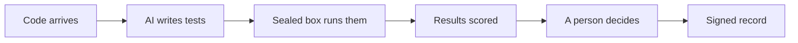

<!-- _class: lead -->

# We test what we write. We trust what we import.

## Most of what we ship is imported. Here is a way to test it too, and to prove we did.

Chris Roadfeldt. Five minutes.

---

# The problem, in one sentence

**Most of the code in any product was written by someone else, and nobody on our side has tested it.**

- A typical service pulls in several hundred packages. Our engineers chose perhaps fifty.
- The worst incidents of recent years arrived through exactly that path: a trusted package, a routine update.
- Regulators and customers now ask us to show, not say, what we verified.

---

# What I am proposing

AI writes tests for every piece of code that enters a product, including the packages our packages depend on. The tests run in a sealed box. The results are scored. A person decides. Everything is signed.

Nothing merges, publishes, or deletes without a person. The harness proposes; a reviewer decides.

Two ways to use it: a developer runs it while working and the tests go in with their pull request; the pipeline runs it on every change and proposes a test pull request. Either way, tests arrive through a pull request and then run with the normal suite.

---

# It already works, on real code

One real pull request on one of my services set out to fix four packages with known vulnerabilities. The harness judged it:

| Package | What the change did | What the harness proved |
|---|---|---|
| python-jose | updated | one vulnerability closed |
| pyasn1 | silently downgraded | one vulnerability **introduced** |
| starlette | left alone | one vulnerability live today, and the upgrade path |

No person wrote any of that. The downgrade is the finding a reviewer would have missed: the change never mentions it.

---

# What it does not do, by design

It does not fix code. A separate fix pipeline does; this one hands it the failing test that proves the problem, and tests whatever comes back. The evidence stays independent of the fix, and the identity that proposes tests never needs the credentials that change production code.

---

# What it honestly cannot do yet

- Prove every fix. Fourteen vulnerabilities were tried; three were proven. The rest are marked unproven, not painted green.
- Judge test strength well enough yet. The strength score is below target and the report says so.
- Sign with production keys. It signs with a development key and states that.

Every limit is written into the result. That is the point: the system reports what it could not do.

---

# What I need

- A decision to run a six-week pilot on two services.
- A named sponsor and a compute budget for six weeks.
- Two product teams willing to review what the harness produces.

**The one number I will report:** regressions and vulnerabilities caught by harness tests that nothing else would have caught, every quarter.

Details: the case, the roadmap, and the evidence are one click each on the project site.
