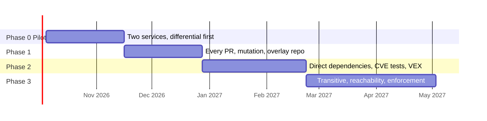

<!-- _class: lead -->

# Fund six weeks. Judge it on the evidence.

## The case for an AI test harness, for CTOs, VPs of Engineering, and CISOs.

Chris Roadfeldt. Fifteen minutes.

---

# The ask

A six-week pilot on two services already building on Konflux, a named sponsor, a compute budget, and two product teams who will review what the harness produces.

At the end of six weeks I show you whether the tests are good enough to continue, measured against real breaking dependency upgrades, not against my opinion.

---

# The problem, with numbers you can check

- A mid-sized Go or Java service resolves several hundred to a few thousand packages. Engineers chose perhaps fifty.
- The rest arrived as dependencies of dependencies. Nobody on our side has read or tested them.
- Konflux already gives us hermetic builds, a bill of materials, and signed provenance for the build. It gives us nothing about whether any of that code works, or whether a new version still does what the old one did.

---

# What the harness adds

| Question | How the harness answers it |
|---|---|
| What does this code do? | AI-written tests, run and scored |
| Did it change from the version we had? | The same tests on old and new, compared |
| Does it fail safely? | Tests with malformed and hostile input |
| Are we exposed to what is already known to be wrong with it? | Tests aimed at each known vulnerability, producing draft VEX statements |
| Can we prove all of this later? | A signed record for every test, attached to the build |

---

# Why AI, and why now

Writing tests for code you did not write is slow and rarely prioritized, so it does not happen. Models are now good enough at reading unfamiliar code that the bottleneck moves from writing tests to verifying them, and verifying is something we automate: compile, run, mutate the code, compare old and new.

A test that survives that gauntlet is worth a reviewer's minute. One that does not is discarded before anyone sees it.

---

# Why not just buy something

- The best-known open source AI test generator is abandoned and copyleft-licensed.
- The closest research tools ship only inside a commercial assistant, for one language.
- Commercial tools cover one language each, do not run in our pipeline, and produce no provenance.
- Nothing, open or commercial, does differential testing of a dependency upgrade for an application.

We would be buying a fraction of the capability and none of the evidence chain.

---

# The evidence so far, on real code

One real pull request meant to fix four vulnerable packages, judged by the harness end to end:

| Package | What the change did | Proven | Unproven |
|---|---|---|---|
| python-jose | updated | 1 vulnerability closed | 2 |
| pyasn1 | silently downgraded | 1 vulnerability introduced | 3 |
| starlette | left alone | 1 vulnerability live, upgrade path found | 6 |

Three signed attestations. Nine of eleven blueprint goals met. Every unproven item is stated as unproven.

---

# How it got there, and why that matters to you

The same package was run six times, changing one thing each run. The first four proved nothing. Each failure became a permanent, self-checked rule in the design, nineteen so far, and the harness refuses to run if any of them fails.

| Run | One change | Proven |
|---|---|---|
| 1 to 4 | one-shot prompts, then tools | 0 |
| 5 | budget the tools, tell the model when it reached the fix | 1 of 3 |
| 6 | same model, faster server | 2 of 3 |

The process improves by design, not by luck, and the record of it is public.

---

# What it costs

| Item | Pilot, six weeks | Steady state |
|---|---|---|
| People | 2 engineers, part-time review from 2 teams | A small team; reviewer time scales with findings, not packages |
| Compute | Sandboxed runs for two services | Risk-weighted, budgeted per ecosystem, with alerts |
| Model usage | Metered, reported per run | Metered; a cheaper model for high-volume classification |
| Risk | Low: advisory only, nothing merges | Managed: only security findings block |

No currency figure yet, on purpose: the pilot exists to produce one. Cost per work item is tracked from day one.

---

# What could go wrong, and what the plan does about it

| Risk | Mitigation |
|---|---|
| Tests are shallow | Mutation gate; differential runs; a public benchmark |
| Reviewers drown | Risk-weighted budgets, one-page packets, advisory by default |
| A malicious package escapes | No network, no secrets, disposable containers, scans before anything runs |
| The AI is manipulated by text in a package | Everything external is data; the agent has no tool that acts outside the sandbox |
| We claim provenance we cannot prove | Every attestation verified by policy; levels measured, not declared |
| Teams distrust AI tests | Every test labeled and human-approved; results published |

---

# What it returns

1. Fewer incidents from code we never looked at. The number I report quarterly: regressions and vulnerabilities caught that nothing else would have caught.
2. Faster, safer upgrades: a dependency bump arrives with a one-page packet within two hours.
3. Proof: every known vulnerability gets a VEX statement backed by a test or a reachability analysis.
4. A growing asset: tests that earn their keep join the standard suite.

---

# The roadmap

Dates are placeholders from a notional October start; durations get replaced by measured velocity after the pilot.

---

# The decision

Fund six weeks. Judge the result on the benchmark and the reviewer feedback. Then decide about the next phase.

The blueprint, the working implementation, and every run's evidence are public on the project site.
