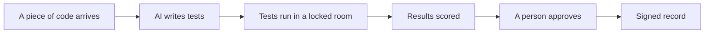

<!-- _class: lead -->

# What if software tested the code it borrows?

## An open plan, in plain words.

Chris Roadfeldt. Ten minutes.

---

# How software gets built today

- Almost every program is assembled from pieces other people wrote, shared freely on the internet.
- A single service can use hundreds of those pieces, most of them pulled in by other pieces.
- Teams test the code they write. The borrowed code, they trust.

---

# Why that matters

- Some of the biggest security incidents of recent years came through a borrowed piece that changed quietly.
- Governments and customers now ask software makers to show what they checked, not just say it.
- Checking hundreds of borrowed pieces by hand has never been affordable. That is the gap.

---

# The idea

Use AI to write tests for every borrowed piece, run those tests in a locked room where the code can do no harm, score whether the tests are any good, and hand the results to a person to approve. Keep a signed record of all of it.

The AI never decides. It proposes. People decide. It fits in two places: on a programmer's desk while they work, and in the factory line that checks every change. In both, a person accepts the tests the way they accept any other change.

---

# It has been tried on real code

On a real project, a change meant to fix four security problems was checked by the harness. It confirmed one fix, found that the change quietly introduced a new problem in a piece nobody mentioned, and showed one problem still open in a piece the change ignored. It also said plainly which problems it could not prove either way.

---

# What it is not

- Not a replacement for engineers. It gives them evidence they never had.
- Not a system that changes code on its own. Every decision is a person's.
- Not finished. It is an open design with working code and honest results, and it improves each time it fails.

Everything, including the failures, is public: the plan, the code, and the evidence.
